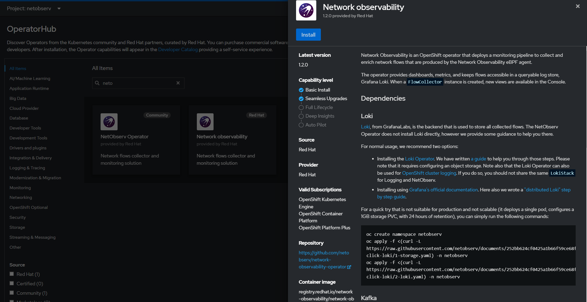
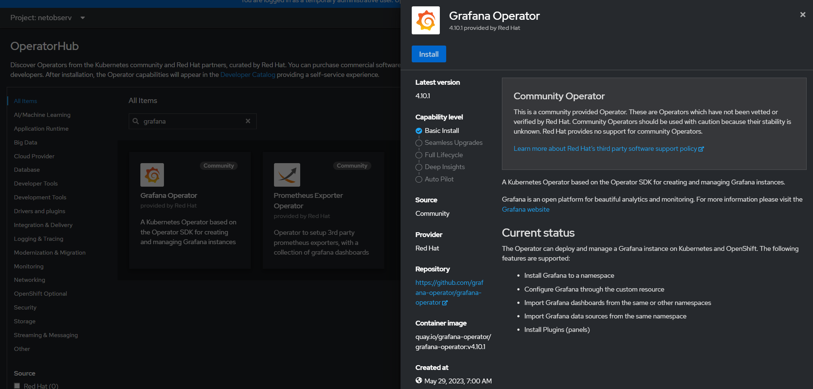
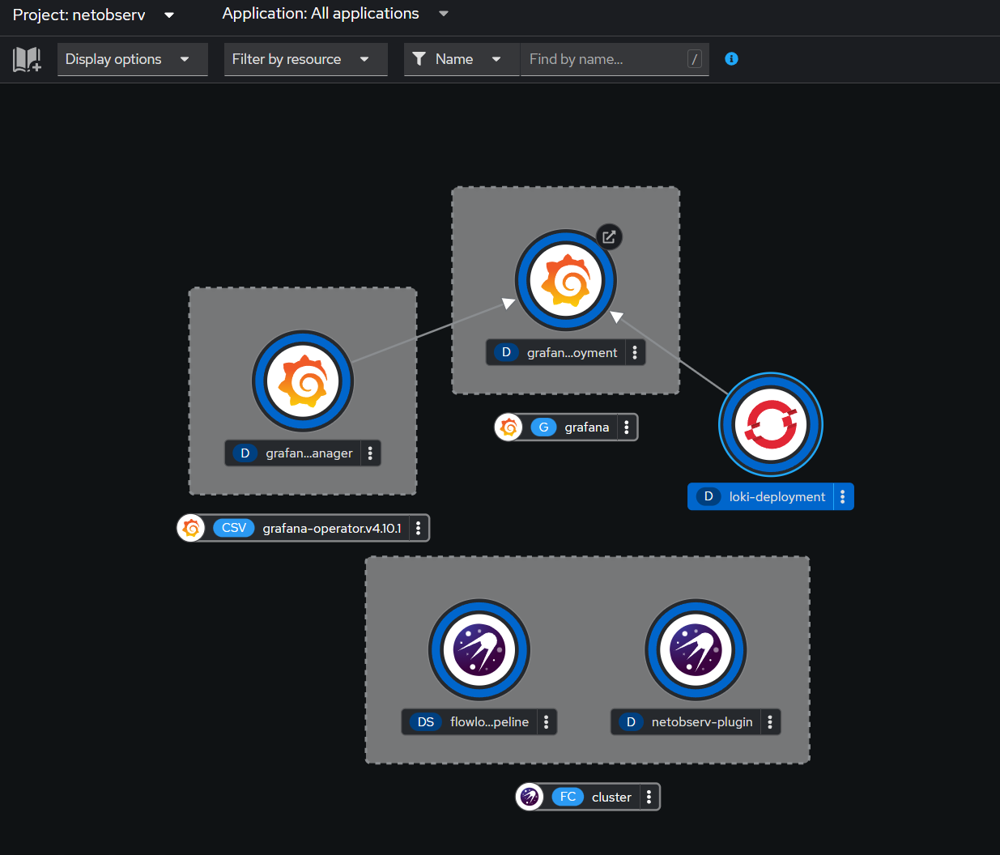

## Network-observability

```bash
oc new-project netobserv
```

## Installing Network Observability Operator


## Installing Grafana Operator Community


## Git Clone Project
```bash
git clone https://github.com/leoevasconcelos/network-observability.git
```

## Installing and Configuring Grafana Loki
```bash
oc create -k manifests/loki/base
```
Deploy Grafana Dashboard
```bash
oc create -k manifests/grafana-operator/overlays/instance/overlay
```
Deploy Network Observability Flow Collector
```bash
oc create -k manifests/netobserv/instance/overlays/default/
```

```bash
oc get flowcollector
```
## Project Developer


## Netobserv Grafana Dashboards


## OpenShift Console Plugin


## Netword Traffic


## Flow Tables


## Network Traffic of some specific Pods


[Link para documentação oficial Red Hat Network Observability](https://docs.openshift.com/container-platform/4.10/networking/network_observability/network-observability-overview.html) 

[Link para documentação oficial Red Hat - Entendendo as características da rede eBPF na RHEL](https://access.redhat.com/documentation/pt-br/red_hat_enterprise_linux/8/html/configuring_and_managing_networking/assembly_understanding-the-ebpf-features-in-rhel_configuring-and-managing-networking) 